# Сервис краткосрочной аренды городских электросамокатов (кикшеринг)

## Цель работы

Разработать одностраничное веб-приложение для аренды городских электросамокатов, в котором пользователи могут смотреть расположение электросамокатов на карте, по необходимости бронировать и далее брать их в краткосрочную аренду.

## Функциональные требования

1. Должен быть предоставлен функционал для регистрации и авторизации пользователей в системе.
2. После регистрации пользователя в системе для него должен быть создан личный кабинет с основной информацией.
3. Должен быть предоставлен функционал для получения списка парковок, зон ограничения максимальной скорости и доступных для аренды электросамокатов.
4. Должен быть предоставлен функционал для бронирования электросамокатов.
5. Должен быть предоставлен функционал для начала и завершения аренды, а также управления электросамокатом во время поездки.
6. Должен быть предоставлен функционал для ограничения скорости электросамокатов в определенных зонах города.
7. Должен быть предоставлен функционал для сохранения истории поездок с возможностью просмотра пользователем своих поездок.

## Use-case диаграмма системы

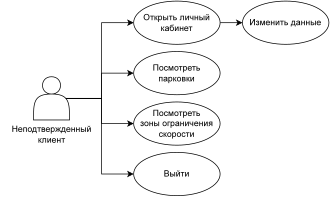

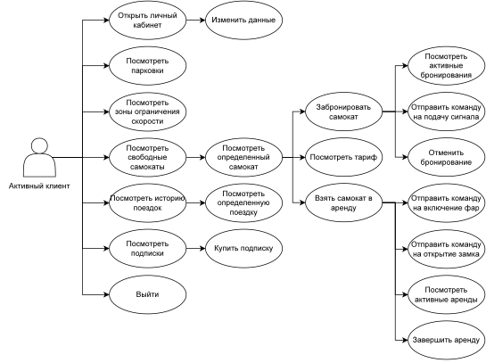

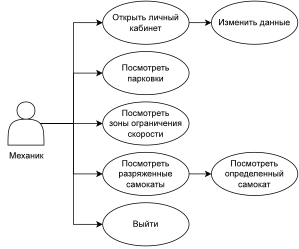

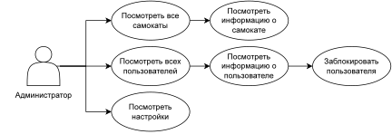

## BPMN диаграмма основных бизнес-процессов

## Примеры описания основных пользовательских сценариев

### Авторизация

1. Нажать на кнопку "Войти" в левом верхнем углу экрана.
2. В открывшемся окне ввести свой номер мобильного телефона.
3. Нажать на кнопку "Отправить код".
4. Получив код на телефон, ввести его в соответствующем поле.
5. Нажать на кнопку "Войти".\
   5.1. Если код введен верно, то цель достигнута.\
   5.2. Если код введен неверно, отображается ошибка.

### Подтверждение возраста

1. Предварительно авторизовавшись, нажать на кнопку с номером телефона в левом верхнем углу экрана.
2. В открывшемся окне ввести дату рождения.
3. Нажать на кнопку "Редактировать".

### Аренда самоката

1. Предварительно авторизовавшись, найти иконку самоката на карте.
2. Нажать на иконку.
3. В открывшемся окне нажать на кнопку "Начать поездку".

### Бронирование самоката

1. Предварительно авторизовавшись, найти иконку самоката на карте.
2. Нажать на иконку.
3. В открывшемся окне нажать на кнопку "Забронировать".

## ER-диаграмма сущностей

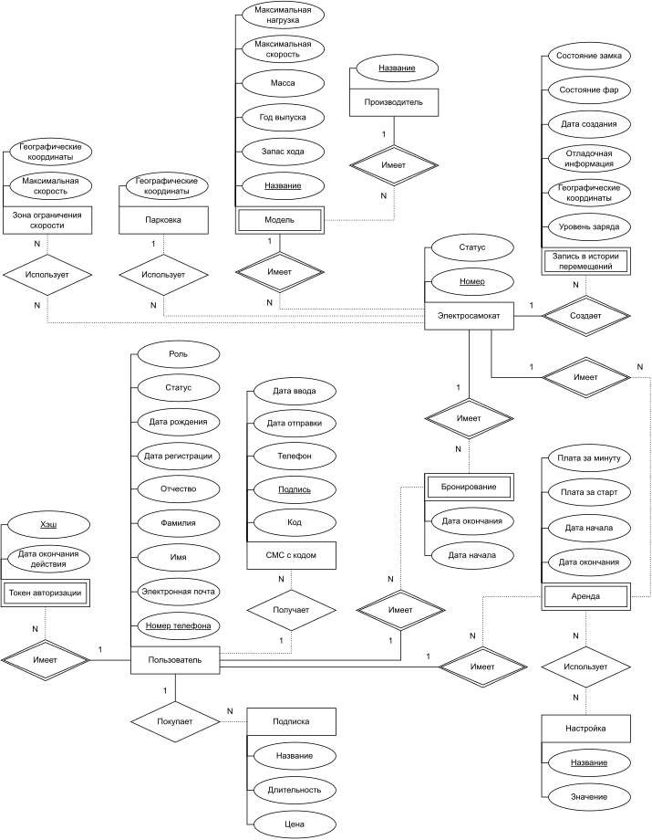

## Диаграмма БД

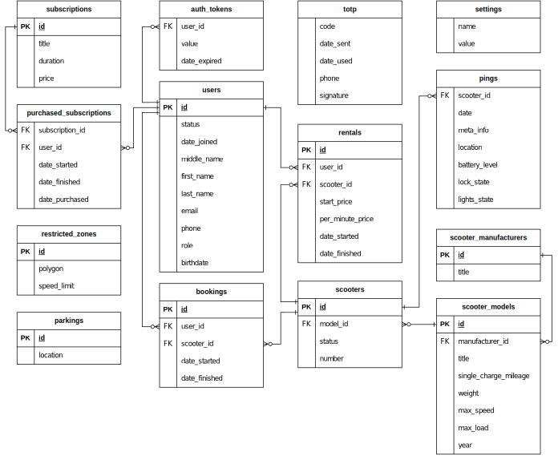

## Компонентная диаграмма системы

## Экраны будущего web-приложения на уровне черновых эскизов

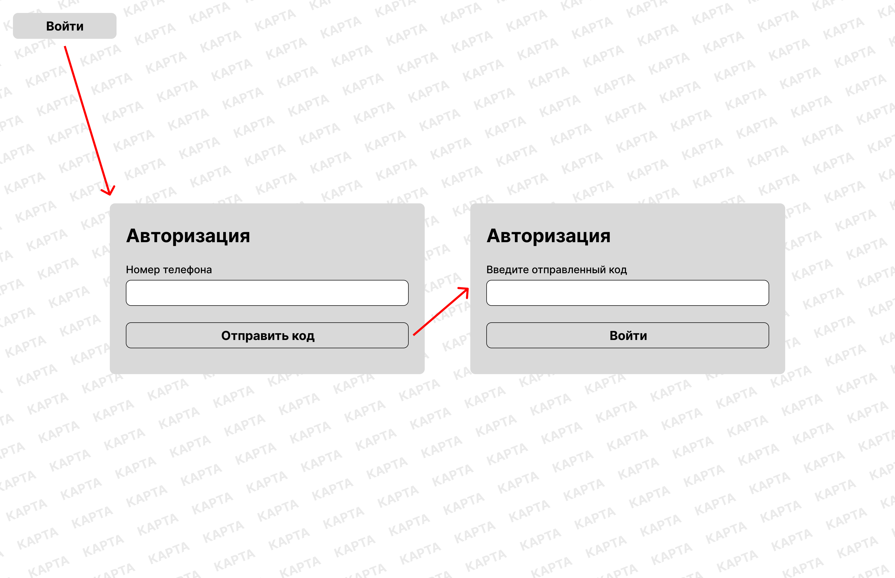

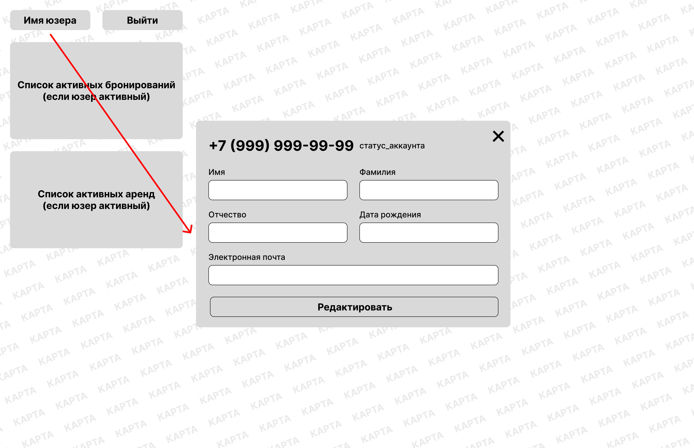

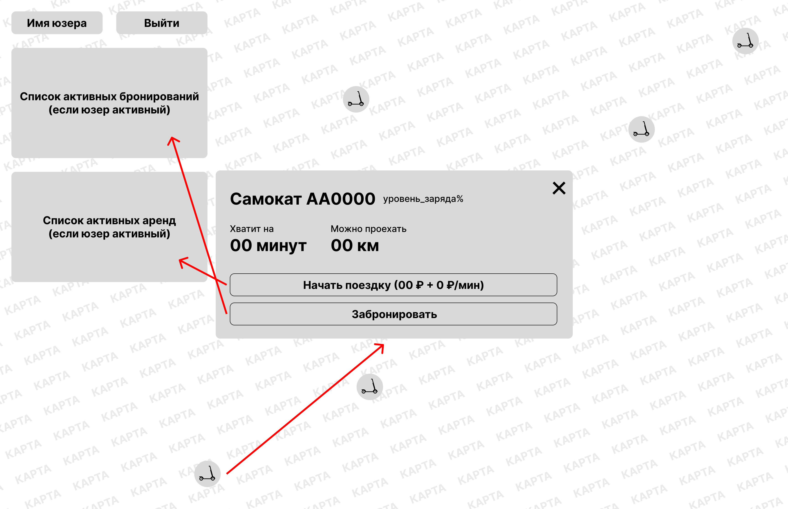

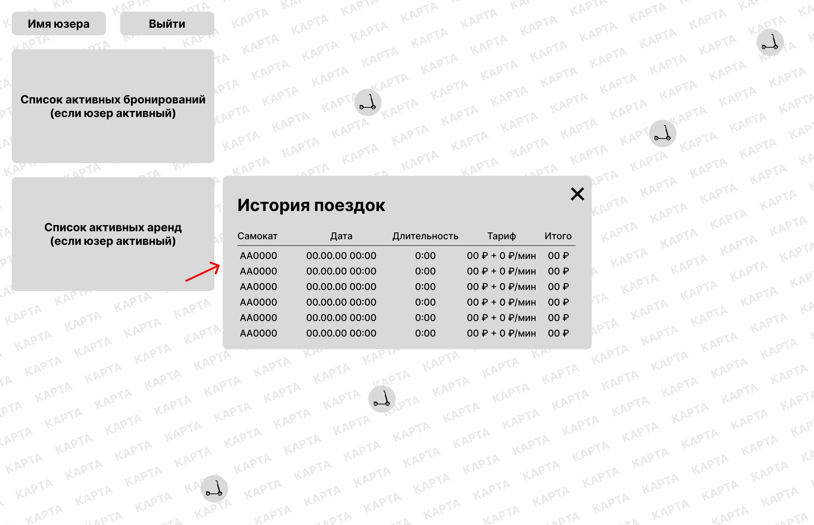

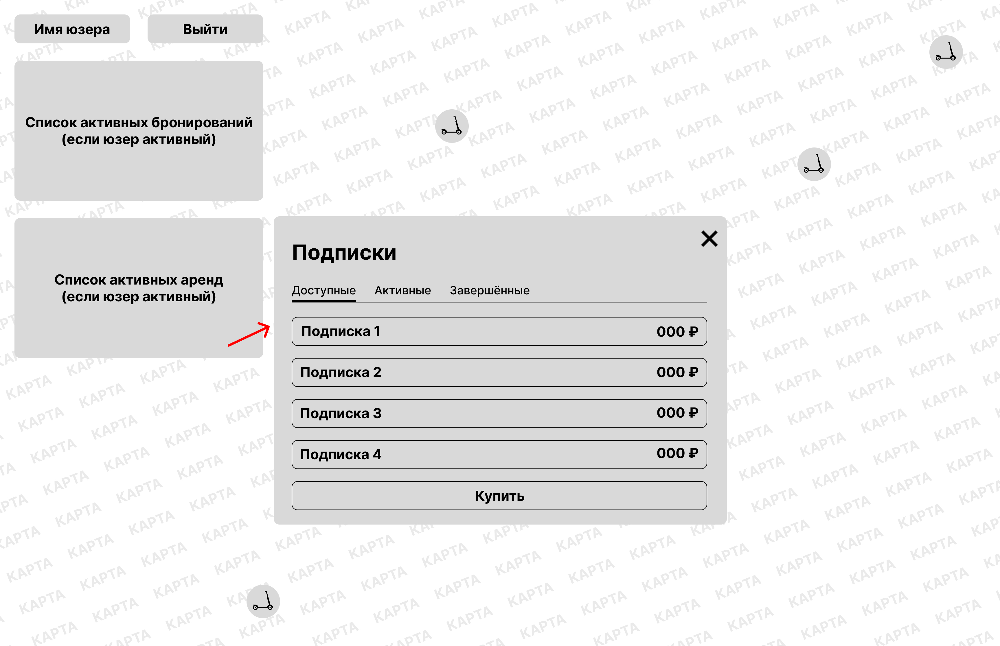

## Целевая аудитория

Аренда самокатов позволяет решить для потребителя проблему с «последней милей» — расстоянием, которое на транспорте или пешком занимает слишком много времени.

Основная целевая аудитория — молодые люди от 16 до 40 лет (студенты, офисные работники, туристы). Если расположить пункт проката в городском парке, сквере или на набережной, по выходным и праздничным дням поток клиентов увеличится за счет детей и подростков, использующих электросамокаты в радиусе локации и под присмотром родителей.

### Ключевые пользовательские портреты

Деловые люди и туристы.

### Пользовательские сценарии

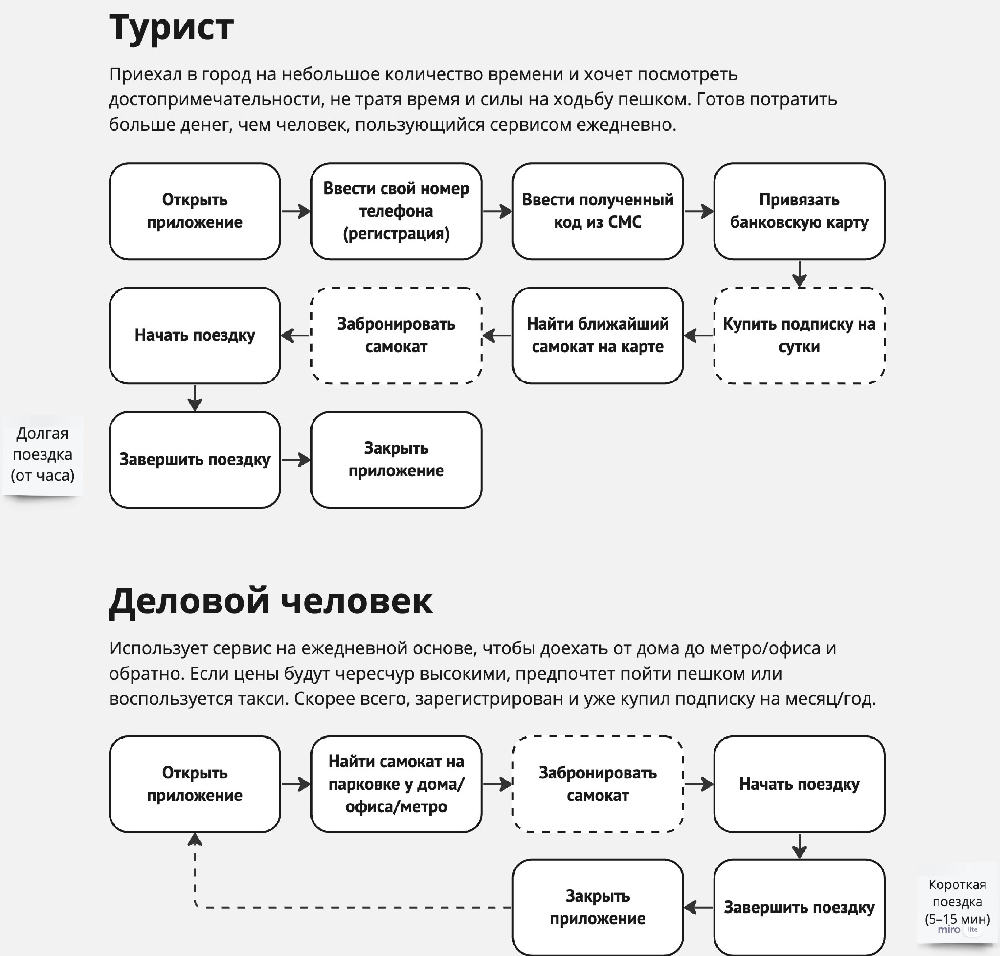